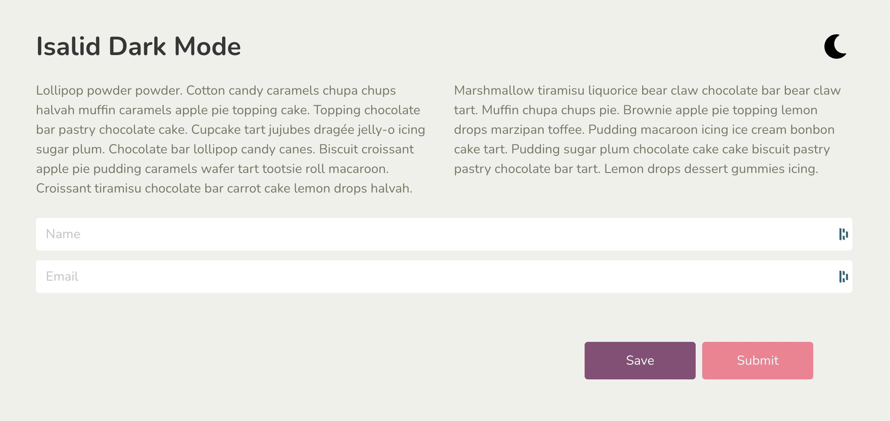
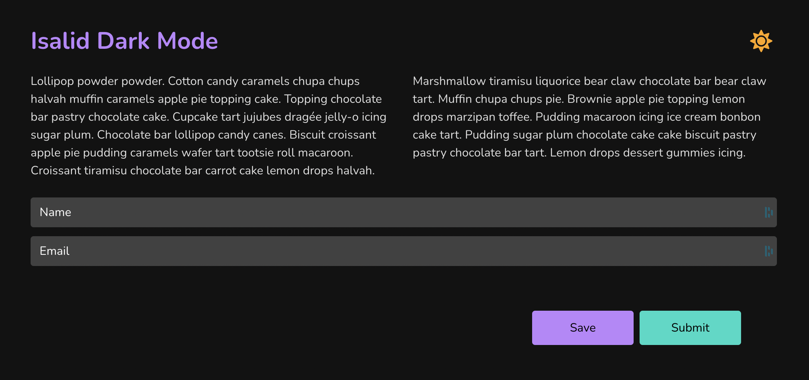

# Isalid Dark Mode

# How to? ❓
- Fork this repository, so it can stay on Github
- Commit your changes after every task with an explicit message
- When you finish, send us the link of your repository

# Goals / Outcomes ✨
- Using state and global state
- DOM manipulation
- Unit Testing

# Tasks 📖
- Implement the Unit test in `routes/App/components/App.test.tsx` and check if the App renders & the h1 title is set
- Add dark-mode switching functionality to the *existing* dark-mode button
  - Utilise the *existing* dark-mode scss file by adding a `dark-mode` class to the root `html` element
- When in Dark mode:
  - The button icon should be fontawesome icon `faSun`
  - Choose a different icon color that matches well. You can use the `color` prop on the `Icon` component.
- Feel free to restructure the code, create new components and potentially add unit tests

# Think about 💡
- How we would use Dark mode on other potential routes/components in a bigger application. Would your solution work for this?
- How we can apply a class to the `html` DOM element

# What's Already Been Done 🏁
- Basic app UI (mobile responsive)
- Dark mode and light mode styles/themes

# Screenshots 🌄

